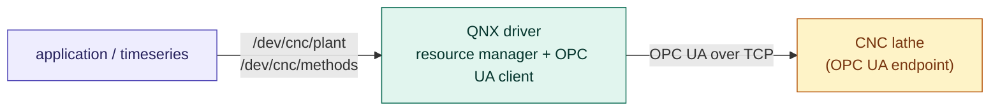
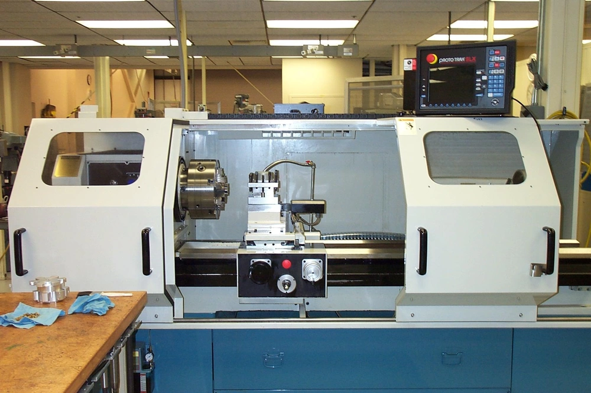

# QNX CNC Driver

A QNX resource manager that exposes a CNC lathe as two files, talking to the machine over OPC UA. Built to work alongside the companion **timeseries** repository.

## Overview

The driver is a single QNX process. From the application side it is a resource manager; from the machine side it is an OPC UA client. Two paths are exposed:

- **`/dev/cnc/plant`** — reads return the latest machine state as one struct: spindle, feed, tool, vibration, production, auxiliary systems, and machine information.
- **`/dev/cnc/methods`** — writes run a method: `EmergencyStop`, `ResetProductionCounters`, or `ChangeTool`. Blocks until the machine answers.

Reads are answered from a cached snapshot. Commands are queued and executed by a separate thread. Pool threads that serve applications never wait on the network.

## The machine

Developed against a **simulated** CNC lathe. The simulation exposes the same OPC UA node tree as the real machine, so the driver can be developed without tying up the lathe. Swapping to the real machine is a one-line change to the OPC UA URL.



<figure>
  
  <figcaption>The machine (simulated OPC UA endpoint).</figcaption>
</figure>
Amber = the simulated machine. Teal = the driver. Purple = the application.

## About OPC UA

[OPC UA](https://opcfoundation.org/about/opc-technologies/opc-ua/) is an open, vendor-neutral standard for industrial communication. It models data as a tree of typed nodes and works over TCP.

The driver uses [open62541](https://www.open62541.org/), an open-source (MPL-2.0) C implementation shipped as a single-file amalgamation (`open62541.c` + `open62541.h`). No separate build of the library is required.

Two OPC UA services are used:

- **TranslateBrowsePathsToNodeIds** — resolves browse paths to NodeIds once at connection.
- **Read** and **Call** — used at runtime. Reads are batched; all 33 nodes come back in one round trip.

## Requirements

- QNX SDP 8.0
- open62541 (see [Dependencies](#dependencies))
- A QNX x86_64 target or VM
- An OPC UA server exposing the machine, reachable over the network

## Dependencies

The driver needs the open62541 single-file amalgamation — two files, `open62541.c` and `open62541.h` — placed in `src/`. No separate build of the library is required, and no shared library is linked.

Tested with open62541 **v1.5.8**.

### Getting the amalgamation

**Prebuilt.** Some releases publish the amalgamation directly on the release page:

- https://github.com/open62541/open62541/releases

Look for a file named `open62541-v<version>-amalgamation.tar.gz` or similar. Extract and copy `open62541.c` and `open62541.h` into `src/`.

**From source.** If no prebuilt amalgamation exists for the version you want:

```sh
git clone --recurse-submodules https://github.com/open62541/open62541.git
cd open62541
git checkout v1.5.8
mkdir build && cd build
cmake -DUA_ENABLE_AMALGAMATION=ON \
      -DUA_BUILD_EXAMPLES=OFF \
      -DUA_BUILD_UNIT_TESTS=OFF \
      -DUA_ENABLE_ENCRYPTION=OFF \
      ..
make open62541-amalgamation
```

The two files land in the build directory. Copy them into `src/`.

open62541 is licensed under MPL 2.0. See the project page for details.

## Build

```sh
make
```

Produces two binaries:

- `build/x86_64-<profile>/MyDriver` — the resource manager
- `build/x86_64-<profile>/cnc_read` — the interactive tool

For release:

```sh
make BUILD_PROFILE=release
```

## Run

On the QNX target:

```sh
./MyDriver -U 100:100 opc.tcp://192.168.1.50:4840/freeopcua/server/
```

`-U uid:gid` drops root after the driver has registered its paths under `/dev`. Stop it with `slay MyDriver`.

## Using the tool

`cnc_read` exercises both paths using only POSIX calls:

```
./cnc_read          live view with command keys
./cnc_read -1       one-shot snapshot
./cnc_read -b N     benchmark N reads (min/avg/p99/max)
```

Live view keys: `e` (estop), `r` (reset), `1`–`9` (change tool), `q` (quit).

After a command the status line shows the round-trip time — pool thread receiving, queue, OPC UA `Call`, machine executing, reply.


## Repository layout

```
src/
  MyDriver.c            resource manager: paths, handlers, queue, threads, shutdown
  opcua_client.c        OPC UA client: two sessions, snapshot, method calls
  opcua_cnc_map.h       public interface
  opcua_client.h        internal interface between the two .c files
  cnc_log.h             timestamped log lines
  cnc_read.c            interactive tool
  open62541.c/.h        open62541 amalgamation (not committed)
Makefile                builds MyDriver and cnc_read
```

## Interface

`opcua_cnc_map.h` is the full contract: the two paths, the `cnc_plant_t` and `cnc_cmd_t` structs, the method and state enums, and the `errno` values `read()` and `write()` can return. Applications include this header and nothing else.

## Errors

| `errno` | meaning |
|---|---|
| `EBUSY` | queue full; retry later |
| `EIO` | no link to the machine |
| `ETIMEDOUT` | machine did not answer in time |
| `EACCES` | machine refused the method |
| `EINVAL` | malformed command |
| `EINTR` | caller interrupted while waiting |
| `ECANCELED` | driver is shutting down |

`EINTR` means the caller was interrupted while blocked in `write()`. The machine may or may not have started the method. Idempotent methods (`EmergencyStop`, `ResetProductionCounters`) are safe to retry. For `ChangeTool`, re-read the plant and check `tool.number` before deciding.

## Design notes

- Polls the machine on a fixed cadence (500 ms) and stores the result in a snapshot. Reads are answered from memory.
- Commands are queued. The pool thread that receives a `write()` returns immediately; a separate thread runs the command and replies when the machine is done.
- Two OPC UA sessions, one per thread. Avoids the open62541 thread-safety issue.
- On shutdown: stop accepting commands, drain the queue, close both sessions cleanly.
- open62541 is compiled from the amalgamation — no dynamic library dependency.

## Companion project

Feeds the **timeseries** repository, which polls `/dev/cnc/plant` and stores samples. The driver has no knowledge of timeseries; the two only meet through the interface above.

## Status

Built and tested against QNX SDP 8.0 on x86_64, open62541 v1.5.8, OPC UA server on a Raspberry Pi Zero 2 W.

## License

MIT — see [LICENSE](LICENSE).

This project does not include any QNX source code. It uses QNX headers and libraries under the terms of the QNX license held by the user.